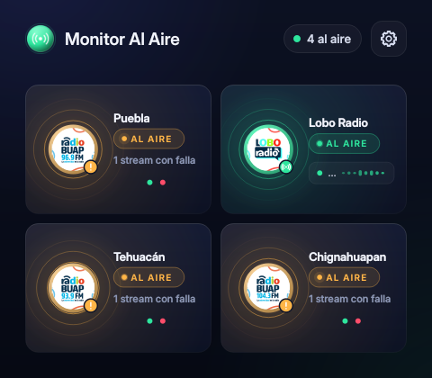
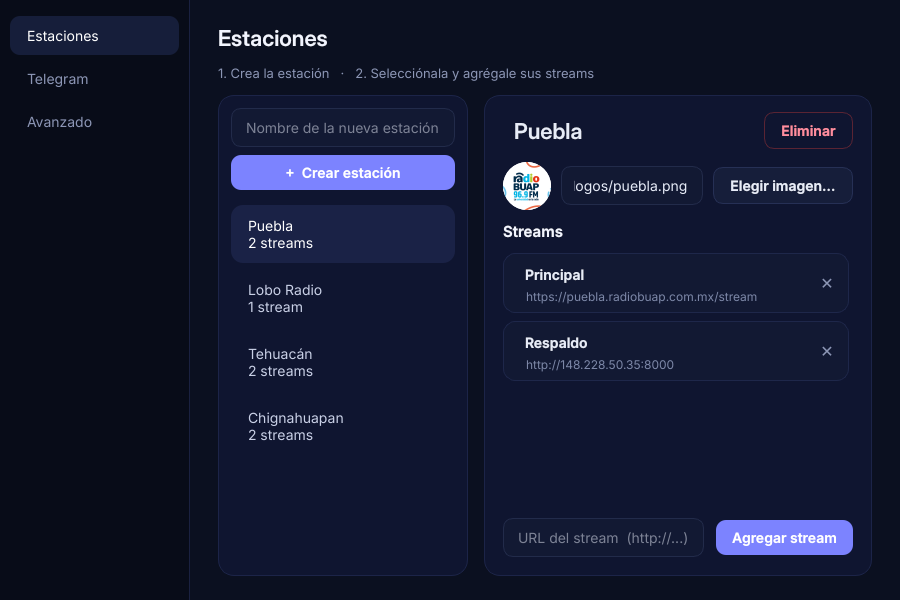

# Monitor Al Aire

Programa de escritorio para Windows que vigila los streams de las estaciones y
avisa por **Telegram** cuando una estación se sale del aire de verdad.

Ya viene configurado con Puebla, Lobo Radio, Tehuacán y Chignahuapan, cada uno con
su logo, su stream principal y su respaldo (Lobo Radio solo tiene principal).

## Descargar e instalar

Hay dos formas:

**A. Ejecutable (.exe):** en la sección **Releases** del repositorio descarga
`MonitorAlAire_Windows_exe.zip`, descomprímelo y abre `MonitorAlAire.exe`.
Ya incluye todo, también ffmpeg.

**B. Versión portátil:** copia la carpeta `MonitorAlAire_Windows` a la PC y abre
`Iniciar Monitor.bat`. Antes de abrir el programa, el .bat revisa y descarga lo
que falte: Python portátil, sus paquetes y ffmpeg. También crea un acceso
directo en el Escritorio. Ver `MonitorAlAire_Windows/LEEME.txt`.

## Cómo se usa

- **Engrane → Estaciones**: primero crea la estación y luego agrégale sus
  streams pegando la URL. Ahí mismo eliges su logo (imagen o URL).
- **Telegram**: pega el token de tu bot (lo da @BotFather), escríbele al bot y
  presiona *Detectar chats*. Con *Enviar prueba* verificas que sí llegue.
- **Avanzado**: tiempos de alerta y la opción *Abrir al iniciar Windows*.
- Si cierras la ventana, el monitor sigue vigilando y queda junto al reloj de
  Windows. Para cerrarlo: clic derecho en ese icono → *Salir*.
- En Telegram, `/estado` te dice cómo está cada estación.

## Cómo decide que una estación está fuera del aire

- La estación está **FUERA DEL AIRE** solo si **ninguno** de sus streams tiene
  audio durante 90 s, ya sea por silencio o por falta de conexión. Se considera
  silencio por debajo de -60 dB (el aire real anda entre -45 y -15 dB).
- Para avisar que **volvió** se necesitan 15 s de audio continuo.
- Si se cae solo **un** stream, manda un aviso aparte a los 5 min.
- Si la PC del monitor se queda sin internet o se suspende, no manda
  alertas falsas.

## Cómo se ve

| Laptop | Ventana pequeña | Configuración |
|---|---|---|
|  |  |  |

## Estructura

- `MonitorAlAire_Windows/app/motor.py`: el motor de monitoreo (ffmpeg, reglas, Telegram).
- `MonitorAlAire_Windows/app/monitor_app.py`: la ventana (PySide6 / Qt).
- `MonitorAlAire_Windows/app/instalar.ps1`: prepara la versión portátil.
- `.github/workflows/compilar-windows.yml`: crea el `.exe` en GitHub y prueba
  las dos versiones en Windows.
- `monitor_radio.py`: el programa anterior (ya no hace falta).
